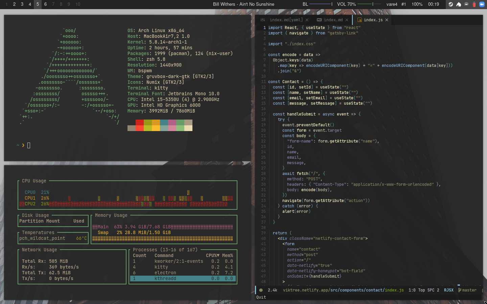

# Arch Linux Desktop "Rastapopoulos"

This branch of my dotfiles repo contains the configuration files for my home desktop that I have nicknamed Rastapopoulos.

---

[Here's a link to how these files are setup and the configuration files for my other machines](https://github.com/viktree/dotfiles)